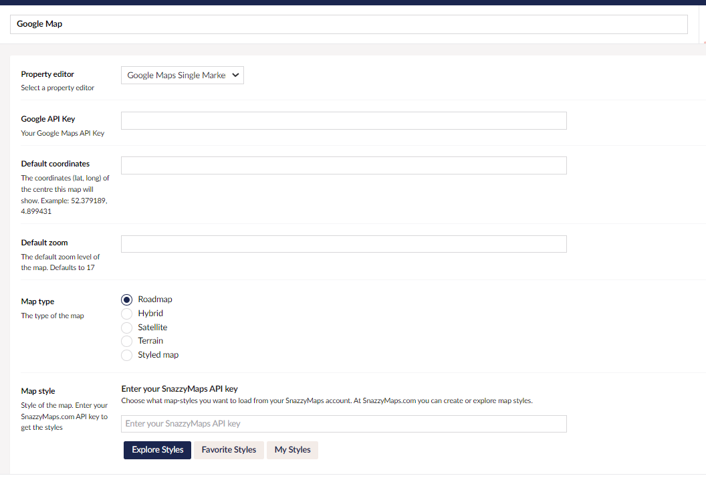

# Installing & Configuring # 


## Installing to Your Umbraco Site

### Umbraco 8
Use NuGet to install Our.Umbraco.GMaps:  
```powershell
Install-Package Our.Umbraco.GMaps
```
Add the following keys to your web.config AppSettings node:

```xml
	<!--Google Maps Configuration-->
	<add key="GoogleMaps:ApiKey" value="" /> <!-- Google Maps API Key -->
	<add key="GoogleMaps:DefaultLocation" value="" /> <!-- Coordinate pair in the format lat,lng -->
	<add key="GoogleMaps:DefaultZoom" value="17" /> <!-- Default Zoom Level for the Maps Property Editor. -->
```


### Umbraco 9
Use NuGet to install Our.Umbraco.GMaps:  
```powershell
Install-Package Our.Umbraco.GMaps
```
Add the following to your appsettings.json file or equivalent settings provider (Azure KeyVault, Environment, etc.):

```json
  "GoogleMaps": {
    "ApiKey": "",
    "DefaultLocation": "",
    "ZoomLevel": 17
  }
```

## Setting Up a Data Type 

In the Umbraco back-office, add a new Data Type using the **"Google Maps Single Marker"** Property Editor.


Values set here for **Google Api Key**, **Default Coordinates**, and **Default Zoom** will override the same values configured via web.config/AppSettings.json. 


## Getting a Google API Key

Login to/create an account at : https://console.cloud.google.com/home/

Enable the following Google Maps API on https://console.cloud.google.com/home/dashboard
- Maps Javascript API
- Geocoding API
- Place API

In the Credentials area, create a new API Key which allows usage of those three APIs. 